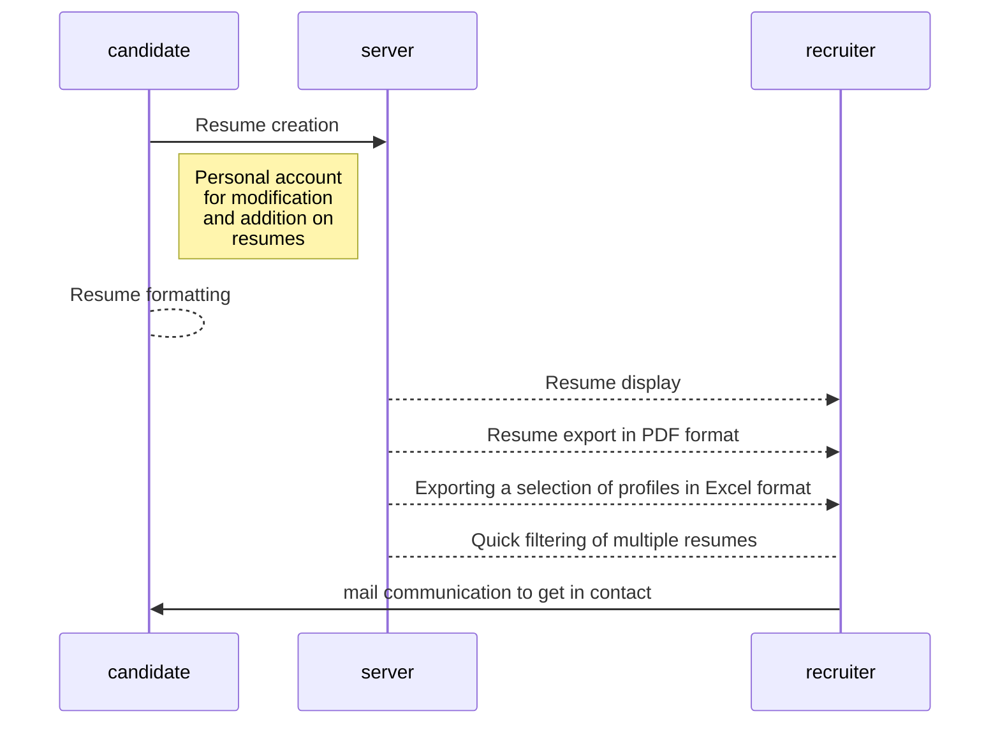

# CVThech (Projet3)

                                                 How to get our project ? 
                                                        
To use our project, you must follow these 2 steps: 

1) When you are on "https://github.com/lecuyste/CVTheque" use the green button to "clone or download".

2) You'll get a link, probably this one :"https://github.com/lecuyste/CVTheque.git" . 
To use it, you have to open git bash, and clone the project in the directory where you want to use it.

If you download it, you'll get a zip file, so unzip it and initialize it with git bash as in step two, and start using it.

                                          Functionality of our site in schematic form :  
                                          

